<div align="center">
  
  
  # Form Flow
  
  **A Dynamic Form Generator Application**
  
  [](https://www.typescriptlang.org/)
  [](https://reactjs.org/)
  [](https://mui.com/)
  [](https://vitejs.dev/)
  
  **[👉 Try the Demo](https://kldsfy-4173.csb.app/)**
  
  
</div>

## 📋 Table of Contents

- [🎯 Overview](#-overview)
- [✨ Features](#-features)
- [🛠️ Tech Stack](#️-tech-stack)
- [🚀 Getting Started](#-getting-started)
- [📖 Usage](#-usage)
- [🏗️ Architecture](#️-architecture)
- [🧪 Testing](#-testing)
- [✅ To do list](#-to-do-list)

## 🎯 Overview

Form Flow is a dynamic form generator application built with **React** and **TypeScript** that enables users to create interactive forms with text and checkbox fields, conditional logic, and yup validation. The application provides an intuitive drag-and-drop interface for form building and real-time form rendering capabilities.

## ✨ Features

### Core Functionality

- **Dynamic Form Creation**: Build forms with text inputs and checkbox elements
- **Drag & Drop Interface**: Intuitive form builder with sortable elements
- **Real-time Preview**: Live form rendering as you build
- **Conditional Logic**: Show/hide fields based on checkbox values
- **Form Validation**: Required field validation with error messaging
- **Data Persistence**: Save and load forms using local storage

### Technical Features

- **TypeScript**: Fully typed codebase for enhanced development experience
- **Responsive Design**: Mobile-friendly interface using **Material-UI**
- **State Management**: Efficient state handling with **Zustand**
- **Form Handling**: Robust form management with **React Hook Form + Yup**
- **Testing**: Comprehensive test coverage with **React Testing Library**
- **API Mocking**: Development API simulation with **MirageJS**

## 🛠️ Tech Stack

| Category             | Technology        | Version  |
| -------------------- | ----------------- | -------- |
| **Framework**        | React             | ^19.1.1  |
| **Language**         | TypeScript        | ~5.8.3   |
| **Build Tool**       | Vite              | ^7.1.2   |
| **UI Library**       | Material-UI (MUI) | ^7.3.2   |
| **State Management** | Zustand           | ^5.0.8   |
| **Form Handling**    | React Hook Form   | ^7.62.0  |
| **Validation**       | Yup               | ^1.7.0   |
| **Drag & Drop**      | DND Kit           | ^6.3.1   |
| **API Mocking**      | MirageJS          | ^0.1.48  |
| **Testing**          | Vitest + RTL      | ^1.2.1   |
| **Styling**          | Emotion           | ^11.14.0 |

## 🚀 Getting Started

### Prerequisites

- Node.js (version 18 or higher)
- npm or yarn package manager

### Installation

1. **Clone the repository**

   ```bash
   git clone https://github.com/b-amir/form-flow.git
   cd form-flow
   ```

2. **Install dependencies**

   ```bash
   npm install
   ```

3. **Start the development server**

   ```bash
   npm run dev
   ```

4. **Open your browser**
   Navigate to `http://localhost:3000` to view the application

### Environment Configuration

The application uses MirageJS for API mocking in all environments. You can control this behavior using environment variables:

- **VITE_USE_MIRAGE**: Set to `'false'` to disable MirageJS mock server (default: enabled)
- **MODE**: Controls the environment mode (development, production, etc.)

Example `.env` file:

```bash
# Disable MirageJS mock server
VITE_USE_MIRAGE=false

# Set environment mode
MODE=production
```

### Available Scripts

```bash
# Development
npm run dev          # Start development server
npm run build        # Build for production
npm run preview      # Preview production build

# Code Quality
npm run lint         # Run ESLint
npm run lint:fix     # Fix ESLint issues
npm run format       # Format code with Prettier
npm run format:check # Check code formatting

# Testing
npm run test         # Run tests
npm run test:watch   # Run tests in watch mode
npm run test:coverage # Run tests with coverage
```

## 📖 Usage

### Creating a Form

1. **Create a form**: Click "Create form" to make a new form
2. **Start Building**: Click "Add Text Field" or "Add Checkbox" to add elements
3. **Configure Elements**: Select elements to edit their properties (label, required status)
4. **Add Conditional Logic**: Set up show/hide conditions based on checkbox values
5. **Preview Form**: Use the preview panel to test your form in real-time
6. **Save Form**: Forms are automatically saved to local storage

### Form Schema

The application uses a unified type system with all definitions consolidated in `src/types/index.ts`:

```typescript
export interface BaseElement {
  id: string;
  type: ElementType;
  label: string;
  isRequired?: boolean;
  conditionalLogic?: ConditionalLogic;
}

export interface TextElement extends BaseElement {
  type: 'text';
  validation?: {
    minLength?: number;
    maxLength?: number;
  };
}

export interface CheckboxElement extends BaseElement {
  type: 'checkbox';
  validation?: {
    required?: boolean;
  };
}

export type Element = TextElement | CheckboxElement;

export interface Form {
  id: string;
  name: string;
  elements: Element[];
  createdAt?: string;
  updatedAt?: string;
}
```

### Conditional Logic

Conditional logic supports advanced show/hide operations with AND/OR operators:

- **Trigger**: Checkbox field values
- **Action**: Show or hide target fields based on conditions
- **Operators**: AND/OR logic for combining multiple conditions
- **Rules**: Multiple conditional rules per element with `showWhen` boolean flags

```typescript
export interface ConditionalRule {
  dependsOn: string; // ID of the field this condition depends on
  showWhen: boolean; // Show element when field value equals this
}

export interface ConditionalLogic {
  operator?: 'AND' | 'OR'; // How to combine multiple rules
  rules: ConditionalRule[]; // Array of conditions to evaluate
}
```

**Examples:**

- Show field when checkbox A is checked: `{ dependsOn: 'checkboxA', showWhen: true }`
- Show field when checkbox A is unchecked: `{ dependsOn: 'checkboxA', showWhen: false }`
- AND logic: All conditions must be true
- OR logic: Any condition can be true

## 🏗️ Architecture

### Application Architecture

```mermaid
graph TD
    A[⚛️ React App]

    A --> B[🎨 Material-UI Components]
    A --> C[📦 Zustand Stores]
    A --> D[📝 React Hook Form + Yup]
    A --> J[🔌 API Service]
    A --> K[📱 Layout Components]

    C --> E[📋 Form Store<br/>CRUD Operations]
    C --> F[🔧 Form Builder Store<br/>Draft Management]
    C --> G[🔔 UI Store<br/>Notifications & Modals]

    J --> H[🔄 MirageJS API]
    H --> I[💾 localStorage]

    K --> L[🛠️ Form Builder Panel]
    K --> M[📄 Forms List Panel]
    K --> N[👁️ Preview Panel]

    L --> O[➕ Element Selection]
    L --> P[🎯 Form Canvas]
    L --> Q[⚙️ Properties Editor]

    N --> R[📋 Form Renderer]
    R --> S[🧠 Conditional Logic Engine]

    C --> J

    style A fill:#e3f2fd,stroke:#1976d2,stroke-width:3px
    style C fill:#f3e5f5,stroke:#7b1fa2,stroke-width:2px
    style H fill:#fff3e0,stroke:#f57c00,stroke-width:2px
    style K fill:#e8f5e8,stroke:#388e3c,stroke-width:2px
    style S fill:#fce4ec,stroke:#c2185b,stroke-width:2px
```



### Component Hierarchy

```mermaid
graph TD
    A[🏠 App]
    A --> B[🎨 ThemeProvider]
    B --> C[📱 Layout]

    C --> D[📄 Forms List Panel]
    C --> E[🛠️ Form Builder Panel]
    C --> F[👁️ Preview Panel]

    D --> G[📋 Forms List]
    G --> H[📝 Form List Items]

    E --> I[📌 Form Builder Header]
    E --> J[➕ Element Selection Row]
    E --> K[🎯 Form Content]
    E --> L[⚙️ Element Properties Editor]

    K --> M[🔄 Drag & Drop Context]
    M --> N[📋 Element List]
    N --> O[🧩 Form Elements]

    F --> P[📋 Form Renderer]
    P --> Q[📝 Form Fields]
    Q --> R[📝 Text Input Field]
    Q --> S[☑️ Checkbox Field]

    L --> T[🔧 Basic Properties]
    L --> U[✅ Validation Settings]
    L --> V[🧠 Conditional Logic Builder]

    style A fill:#e3f2fd,stroke:#1976d2,stroke-width:3px
    style C fill:#f1f8e9,stroke:#388e3c,stroke-width:2px
    style M fill:#fff8e1,stroke:#f57c00,stroke-width:2px
    style P fill:#fce4ec,stroke:#c2185b,stroke-width:2px
    style V fill:#f3e5f5,stroke:#7b1fa2,stroke-width:2px
```



### Data Flow

```mermaid
sequenceDiagram
    participant 👤 as User
    participant 🛠️ as Form Builder
    participant 📋 as Form Store
    participant 🔧 as Form Builder Store
    participant 🔄 as MirageJS API
    participant 💾 as localStorage

    Note over 👤,💾: 📝 Form Creation Flow
    👤->>🛠️: ➕ Add Element
    🛠️->>🔧: addElement()
    🔧->>🔧: 📝 Update Draft State
    🔧-->>🛠️: ✅ State Updated
    🛠️-->>👤: 🎨 UI Updated

    👤->>🛠️: 💾 Save Form
    🛠️->>📋: createForm()
    📋->>🔄: POST /forms
    🔄->>💾: 💾 Persist Data
    💾-->>🔄: ✅ Success
    🔄-->>📋: 📄 Return Form
    📋-->>🛠️: ✅ Form Saved
    🛠️-->>👤: 🎉 Success Notification

    Note over 👤,💾: 🧠 Conditional Logic Flow
    👤->>🛠️: ⚙️ Set Conditional Logic
    🛠️->>🔧: updateElement()
    🔧->>🔧: 📝 Update Element Rules
    🔧-->>🛠️: ✅ State Updated
    🛠️->>🛠️: 🧮 Evaluate Conditions
    🛠️-->>👤: 👁️ Show/Hide Elements
```



### Key Architectural Decisions

- **Data Persistence**: MirageJS API simulation with localStorage for development
- **Component Architecture**: Modular design with clear separation of concerns
- **Conditional Logic**: Real-time evaluation engine with AND/OR operators
- **Testing**: Vitest over Jest for better integration with Vite and similar syntax

## 🧪 Testing

### Testing Strategy

The project uses **Vitest** with **React Testing Library** for comprehensive testing:

```bash
# Run all tests
npm run test

# Run tests with coverage report
npm run test:coverage

# Run tests in watch mode during development
npm run test:watch
```

### Testing Coverage

- **Component Tests**: Form renderer, element properties editor, conditional logic builder
- **Utility Tests**: Conditional logic evaluation with AND/OR operators, store helper functions
- **Store Tests**: Form builder state management, UI state, form CRUD operations
- **Integration Tests**: Form rendering with conditional logic, user interactions

### Testing Setup

- **Framework**: Vitest with jsdom environment for browser simulation
- **Testing Library**: React Testing Library for component testing
- **Custom Utilities**: Theme provider wrapper for consistent rendering
- **Mocking**: Vi.fn() for function mocking and API simulation

## ✅ To do list

- [ ] Support more form field types
- [ ] Implement form sharing
