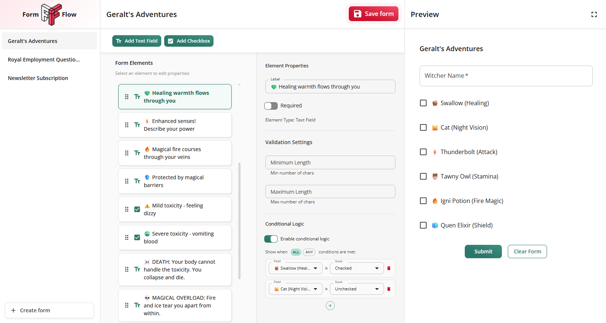

<div align="center">
  
  
  # Form Flow
  
  **A Dynamic Form Generator Application**
  
  [](https://www.typescriptlang.org/)
  [](https://reactjs.org/)
  [](https://mui.com/)
  [](https://vitejs.dev/)
  
  **[👉 Try the Demo](https://zs65t7-3000.csb.app)**
  
  
</div>

## 📋 Table of Contents

- [🎯 Overview](#-overview)
- [✨ Features](#-features)
- [🛠️ Tech Stack](#️-tech-stack)
- [🚀 Getting Started](#-getting-started)
- [📖 Usage](#-usage)
- [📁 Project Structure](#-project-structure)
- [🏗️ Architecture Decisions](#️-architecture-decisions)
- [🧪 Testing](#-testing)
- [📋 Development Guidelines](#-development-guidelines)
- [🤝 Contributing](#-contributing)
- [✅ To do list](#-to-do-list)

## 🎯 Overview

Form Flow is a dynamic form generator application built with React and TypeScript that enables users to create interactive forms with text and checkbox fields, conditional logic, and yup validation. The application provides an intuitive drag-and-drop interface for form building and real-time form rendering capabilities.

## ✨ Features

### Core Functionality

- **Dynamic Form Creation**: Build forms with text inputs and checkbox elements
- **Drag & Drop Interface**: Intuitive form builder with sortable elements
- **Real-time Preview**: Live form rendering as you build
- **Conditional Logic**: Show/hide fields based on checkbox values
- **Form Validation**: Required field validation with error messaging
- **Data Persistence**: Save and load forms using local storage

### Technical Features

- **TypeScript**: Fully typed codebase for enhanced development experience
- **Responsive Design**: Mobile-friendly interface using Material-UI
- **State Management**: Efficient state handling with Zustand
- **Form Handling**: Robust form management with React Hook Form + Yup
- **Testing**: Comprehensive test coverage with React Testing Library
- **API Mocking**: Development API simulation with MirageJS

## 🛠️ Tech Stack

| Category             | Technology        | Version  |
| -------------------- | ----------------- | -------- |
| **Framework**        | React             | ^19.1.1  |
| **Language**         | TypeScript        | ~5.8.3   |
| **Build Tool**       | Vite              | ^7.1.2   |
| **UI Library**       | Material-UI (MUI) | ^7.3.2   |
| **State Management** | Zustand           | ^5.0.8   |
| **Form Handling**    | React Hook Form   | ^7.62.0  |
| **Validation**       | Yup               | ^1.7.0   |
| **Drag & Drop**      | DND Kit           | ^6.3.1   |
| **API Mocking**      | MirageJS          | ^0.1.48  |
| **Testing**          | Vitest + RTL      | ^1.2.1   |
| **Styling**          | Emotion           | ^11.14.0 |

## 🚀 Getting Started

### Prerequisites

- Node.js (version 18 or higher)
- npm or yarn package manager

### Installation

1. **Clone the repository**

   ```bash
   git clone <repository-url>
   cd form-flow
   ```

2. **Install dependencies**

   ```bash
   npm install
   ```

3. **Start the development server**

   ```bash
   npm run dev
   ```

4. **Open your browser**
   Navigate to `http://localhost:3000` to view the application

### Available Scripts

```bash
# Development
npm run dev          # Start development server
npm run build        # Build for production
npm run preview      # Preview production build

# Code Quality
npm run lint         # Run ESLint
npm run lint:fix     # Fix ESLint issues
npm run format       # Format code with Prettier
npm run format:check # Check code formatting

# Testing
npm run test         # Run tests
npm run test:watch   # Run tests in watch mode
npm run test:coverage # Run tests with coverage
```

## 📖 Usage

### Creating a Form

1. **Start Building**: Click "Add Text Field" or "Add Checkbox" to add elements
2. **Configure Elements**: Select elements to edit their properties (label, required status)
3. **Add Conditional Logic**: Set up show/hide conditions based on checkbox values
4. **Preview Form**: Use the preview panel to test your form in real-time
5. **Save Form**: Forms are automatically saved to local storage

### Form Schema

The application uses a structured schema for form definitions:

```typescript
interface Form {
  id: string;
  name: string;
  elements: Element[];
}

type Element = TextElement | CheckboxElement;

interface BaseElement {
  id: string;
  type: 'text' | 'checkbox';
  label: string;
  isRequired?: boolean;
}

interface TextElement extends BaseElement {
  type: 'text';
  validation?: {
    minLength?: number;
    maxLength?: number;
  };
}

interface CheckboxElement extends BaseElement {
  type: 'checkbox';
  validation?: {
    required?: boolean;
  };
}
```

### Conditional Logic

Conditional logic supports advanced show/hide operations with multiple rules and operators:

- **Trigger**: Checkbox field values
- **Action**: Show or hide target fields
- **Operators**: AND/OR logic for combining multiple conditions
- **Rules**: Multiple conditional rules per element
- **Logic**: Complex condition evaluation with `showWhen` boolean flags

```typescript
type ConditionOperator = 'equals' | 'not_equals';

interface Condition {
  fieldId: string; // ID of the field this condition depends on
  operator: ConditionOperator; // Comparison operator
  value: boolean; // Value to compare against
}
```

**Examples:**

- Show field when checkbox A is checked: `{ fieldId: 'checkboxA', operator: 'equals', value: true }`
- Show field when checkbox A is unchecked: `{ fieldId: 'checkboxA', operator: 'not_equals', value: true }`
- Multiple conditions can be combined using the form builder interface to create complex conditional logic

## 📁 Project Structure

```
src/
├── components/           # Reusable UI components
│   ├── common/          # Shared components
│   ├── element-properties/ # Element configuration panels
│   ├── fields/          # Form field components
│   ├── form/            # Form-related components
│   └── layout/          # Layout components
├── features/            # Feature-specific modules
│   └── form-management/ # Form CRUD operations
├── hooks/               # Custom React hooks
├── server/              # MirageJS API mocking
│   ├── factories/       # Data factories
│   ├── fixtures/        # Sample data
│   ├── models/          # Data models
│   └── routes/          # API routes
├── services/            # External service integrations
├── styles/              # Theme and styling
├── types/               # TypeScript type definitions
└── utils/               # Utility functions
```

## 🏗️ Architecture Decisions

### Application Architecture


### Component Hierarchy


### Data Flow


### Key Architectural Decisions

- **Data Persistence**: Browser localStorage with automatic serialization
- **Testing Framework**: Vitest over Jest for better Vite integration and similar syntax

### Component Architecture

- **Modular Design**: Separation of concerns with dedicated component folders
- **Props Interface**: Strongly typed component interfaces
- **Reusable Components**: Shared UI components across the application

### Form Management

- **Dynamic Schema**: JSON-based form definitions with TypeScript validation
- **Conditional Logic**: Element visibility based on form state
- **Validation Strategy**: Yup schema validation with real-time feedback

### Styling System

- **Design Tokens**: Consistent spacing, colors, and typography
- **Component Theming**: Material-UI theme customization
- **Responsive Design**: Mobile-first approach with breakpoint system
- **Theme System**: Centralized design tokens and color variables

## 🧪 Testing

### Form Creation Workflow


### Testing Strategy


The project uses **Vitest** with **React Testing Library** for a modern testing approach:

```bash
# Run all tests
npm run test

# Run tests with coverage report
npm run test:coverage

# Run tests in watch mode during development
npm run test:watch
```

### Current Testing Coverage

- **Component Tests**: Form renderer, element properties editor, conditional logic builder
- **Utility Tests**: Conditional logic evaluation, store helper functions
- **Store Tests**: Form builder state management, UI state, form CRUD operations
- **Integration Tests**: Form rendering with conditional logic, user interactions

### Testing Setup

- **Framework**: Vitest with jsdom environment
- **Testing Library**: React Testing Library for component testing
- **Custom Utilities**: Theme provider wrapper for consistent rendering
- **Mocking**: Vi.fn() for function mocking and API simulation

## 📋 Development Guidelines

### Code Quality

- **TypeScript Strict Mode**: Enabled for enhanced type safety
- **ESLint + Prettier**: Automated code formatting and linting
- **Conventional Commits**: Structured commit messages
- **Clean Code Principles**: Following Robert C. Martin's guidelines

### Component Design

- **Single Responsibility**: Each component has one clear purpose
- **Composition over Inheritance**: Favor component composition
- **Props Interface**: Well-defined TypeScript interfaces
- **Accessibility**: ARIA labels and keyboard navigation support

## 🤝 Contributing

1. Fork the repository
2. Create a feature branch (`git checkout -b feature/amazing-feature`)
3. Commit your changes (`git commit -m 'feat: add amazing feature'`)
4. Push to the branch (`git push origin feature/amazing-feature`)
5. Open a Pull Request

### Commit Convention

This project follows [Conventional Commits](https://www.conventionalcommits.org/):

- `feat:` New features
- `fix:` Bug fixes
- `docs:` Documentation changes
- `style:` Code style changes
- `refactor:` Code refactoring
- `test:` Test additions or modifications
- `chore:` Build process or auxiliary tool changes

## ✅ To do list

- [ ] Add form validation
- [ ] Support more form field types
- [ ] Implement form sharing
